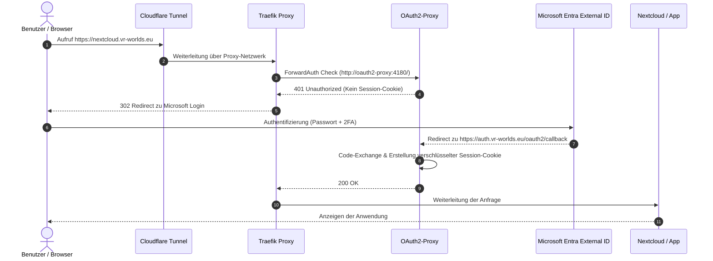

# `HOW_TO_ENTRA.md`

# 🔐 Microsoft Entra External ID (CIAM) & Traefik SSO Integration Guide

Diese Dokumentation beschreibt die vollständige Einrichtung von **Microsoft Entra External ID (CIAM)** als zentraler Identity Provider (IdP) vor Docker-Anwendungen. Die Authentifizierung erfolgt über **Traefik ForwardAuth** und **OAuth2-Proxy** hinter einem **Cloudflare Zero Trust Tunnel**.

---

## 📐 Architekturanordnung



---

## 🧰 Voraussetzungen

1. Eine eigene Domain (z. B. `vr-worlds.eu`) auf **Cloudflare** verwaltet.
2. Ein eingerichteter **Cloudflare Zero Trust Tunnel**.
3. Ein **Microsoft 365 / Azure Account**.
4. Ein funktionierender Docker-Host mit **Traefik v3** und **Portainer**.

---

## 🚀 Schritt 1: Microsoft Entra External Tenant (CIAM) erstellen

Microsoft Entra External ID bietet **50.000 kostenlose monatlich aktive Benutzer (MAU)**.

1. Im **Microsoft Entra Admin Center** (`https://entra.microsoft.com`) anmelden.
2. Links auf **Identity** -> **Overview** -> **Manage tenants** (Mandanten verwalten) klicken.
3. Oben auf **+ Create** (+ Erstellen) klicken.
4. Typ auswählen: **External** (Kunden-/Externe Identitäten) -> **Continue**.
5. Mandanten-Details ausfüllen:
   * **Mandantenname:** z. B. `VR-Worlds External Auth`
   * **Domänenname:** z. B. `vrworldsexternal.onmicrosoft.com`
   * **Land/Region:** `Deutschland` oder `Europäische Union`
6. Azure-Abonnement verknüpfen (gewährleistet die dauerhaften 50.000 freien MAU) und auf **Erstellen** klicken.
7. Nach der Erstellung oben rechts auf das Profilsymbol klicken und zum neuen Verzeichnis **`VRWORLDSEXTERNAL`** wechseln.

---

## 📝 Schritt 2: App-Registrierung im External Tenant

1. Im neuen External Tenant zu **Identity** -> **Applications** -> **App registrations** navigieren.
2. Auf **+ New registration** klicken:
   * **Name:** `Traefik SSO Gateway`
   * **Unterstützte Kontotypen:** `Konten in einem beliebigen Organisationsverzeichnis und persönliche Microsoft-Konten` (Multi-Tenant).
   * **Redirect URI:** Plattform **Web** wählen und folgende URL eintragen:
     ```text
     https://auth.vr-worlds.eu/oauth2/callback
     ```
   * Auf **Register** klicken.

3. **Wichtige IDs notieren (Übersichtsseite):**
   * **Application (client) ID:** `4e667d31-f86f-4311-b33e-3299b559a30c`
   * **Directory (tenant) ID:** `76e2bb74-0ca2-47e6-88fe-c47e870a0d1d`

4. **Client Secret erstellen:**
   * In der linken Navigation auf **Certificates & secrets** -> **Client secrets** -> **+ New client secret**.
   * Beschreibung eingeben (`traefik-sso`) und Gültigkeit wählen.
   * **WICHTIG:** Den generierten **`Value`** (Wert, beginnt z. B. mit `kYQ8Q~...`) sofort kopieren! 
   * *(Achtung: Nicht die `Secret ID` kopieren!)*

---

## 🌐 Schritt 3: Cloudflare Zero Trust DNS & Tunnel Einrichten

In der Cloudflare Zero Trust Konfiguration müssen zwei öffentliche Hostnames auf den Traefik-Container verweisen:

1. **Tunnel Public Hostnames (`Networks -> Tunnels -> Edit -> Public Hostnames`):**
   * `nextcloud.vr-worlds.eu` -> `HTTP` -> `traefik:80`
   * `auth.vr-worlds.eu` -> `HTTP` -> `traefik:80`

2. **Cloudflare DNS Records (`dash.cloudflare.com -> Domain -> DNS -> Records`):**
   * Sicherstellen, dass ein **CNAME**-Eintrag für `auth` auf die Tunnel-Adresse zeigt (z.B. `xxxx.cfargotunnel.com`) und der Status auf **Proxied (Orange Cloud 🟧)** steht.

---

## 🐳 Schritt 4: Docker-Konfiguration (`01-networking`)

### 1. `.env`-Datei auf dem Server / Portainer
```env
# Core Networking
CLOUDFLARE_API_TOKEN=dein_cloudflare_tunnel_token

# Microsoft Entra External ID Credentials
ENTRA_CLIENT_ID=4e667d31-f86f-4311-b33e-3299b559a30c
ENTRA_TENANT_ID=76e2bb74-0ca2-47e6-88fe-c47e870a0d1d
ENTRA_CLIENT_SECRET=dein_kopierter_secret_value_string

# Zufälliger 32-Zeichen Cookie Secret (z.B. openssl rand -base64 32)
OAUTH2_COOKIE_SECRET=A1b2C3d4E5f6G7h8I9j0K1l2M3n4O5p6
```

### 2. `01-networking/docker-compose.yml`
```yaml
name: networking-stack

networks:
  proxy:
    name: proxy # Erstellt das globale gemeinsame Netz

services:
  traefik:
    container_name: traefik
    image: traefik:v3.0
    restart: always
    command:
      - '--providers.docker=true'
      - '--providers.docker.exposedbydefault=false'
      - '--entrypoints.web.address=:80'
      - '--api.dashboard=true'
      - '--api.insecure=true'
    ports:
      - '127.0.0.1:8080:8080'
    networks:
      - proxy
    volumes:
      - /var/run/docker.sock:/var/run/docker.sock:ro

  cloudflared:
    container_name: cloudflared
    image: cloudflare/cloudflared:latest
    restart: always
    environment:
      - TUNNEL_TOKEN=${CLOUDFLARE_API_TOKEN}
    command: tunnel --no-autoupdate run --token ${CLOUDFLARE_API_TOKEN}
    networks:
      - proxy

  oauth2-proxy:
    container_name: oauth2-proxy
    image: quay.io/oauth2-proxy/oauth2-proxy:v7.6.0
    restart: always
    environment:
      # OIDC Konfiguration für Microsoft Entra External ID (CIAM)
      - OAUTH2_PROXY_PROVIDER=oidc
      - OAUTH2_PROXY_PROVIDER_DISPLAY_NAME="Microsoft External Login"
      - OAUTH2_PROXY_CLIENT_ID=${ENTRA_CLIENT_ID}
      - OAUTH2_PROXY_CLIENT_SECRET=${ENTRA_CLIENT_SECRET}
      
      # CIAM Endpunkt mit .ciamlogin.com
      - OAUTH2_PROXY_OIDC_ISSUER_URL=https://vrworldsexternal.ciamlogin.com/${ENTRA_TENANT_ID}/v2.0
      - OAUTH2_PROXY_INSECURE_OIDC_SKIP_ISSUER_VERIFICATION=true
      
      # Entra CIAM Token Claims Anpassung
      - OAUTH2_PROXY_OIDC_EMAIL_CLAIM=sub
      - OAUTH2_PROXY_INSECURE_OIDC_ALLOW_UNVERIFIED_EMAIL=true
      
      # Automatischer Redirect (Überspringen des Zwischen-Buttons)
      - OAUTH2_PROXY_SKIP_PROVIDER_BUTTON=true
      
      # Traefik ForwardAuth & Cookie Konfiguration
      - OAUTH2_PROXY_UPSTREAMS=static://202
      - OAUTH2_PROXY_REVERSE_PROXY=true
      - OAUTH2_PROXY_COOKIE_SECRET=${OAUTH2_COOKIE_SECRET}
      - OAUTH2_PROXY_COOKIE_DOMAINS=.vr-worlds.eu
      - OAUTH2_PROXY_WHITELIST_DOMAINS=.vr-worlds.eu
      - OAUTH2_PROXY_COOKIE_SECURE=true
      - OAUTH2_PROXY_EMAIL_DOMAINS=*
      - OAUTH2_PROXY_HTTP_ADDRESS=0.0.0.0:4180
      - OAUTH2_PROXY_REDIRECT_URL=https://auth.vr-worlds.eu/oauth2/callback
      - OAUTH2_PROXY_SET_XAUTHREQUEST=true
    networks:
      - proxy
    labels:
      - traefik.enable=true
      - traefik.docker.network=proxy
      - traefik.http.routers.oauth2-proxy.rule=Host(`auth.vr-worlds.eu`)
      - traefik.http.routers.oauth2-proxy.entrypoints=web
      - traefik.http.services.oauth2-proxy.loadbalancer.server.port=4180

      # Traefik ForwardAuth Middleware Definition
      - traefik.http.middlewares.entra-auth.forwardauth.address=http://oauth2-proxy:4180/
      - traefik.http.middlewares.entra-auth.forwardauth.trustForwardHeader=true
      - traefik.http.middlewares.entra-auth.forwardauth.authResponseHeaders=X-Auth-Request-User,X-Auth-Request-Email
```

---

## 🔒 Schritt 5: Anwendungen schützen (`03-apps/nextcloud`)

Um eine beliebige Anwendung mit dem Microsoft Entra SSO-Schutz zu versehen, wird lediglich **ein Label** im Docker Compose der Anwendung hinzugefügt:

```yaml
labels:
  - traefik.enable=true
  - traefik.docker.network=proxy
  - traefik.http.routers.nextcloud.rule=Host(`nextcloud.vr-worlds.eu`)
  - traefik.http.routers.nextcloud.entrypoints=web
  - traefik.http.services.nextcloud.loadbalancer.server.port=80
  
  # ERZWINGT DIE MICROSOFT ENTRA ID AUTHENTIFIZIERUNG:
  - traefik.http.routers.nextcloud.middlewares=entra-auth@docker
```

---

## 🎓 Lessons Learned & Fehlerbehebung (Troubleshooting)

Im Laufe der Einrichtung traten folgende typische Herausforderungen auf:

### 1. `AADSTS500208: The domain is not a valid login domain`
* **Ursache:** Verwendung der Standard-URL `login.microsoftonline.com` für einen spezialisierten **Entra External ID (CIAM)** Mandanten.
* **Lösung:** Nutzung des spezifischen CIAM-Endpunkts:
  `https://<tenant-name>.ciamlogin.com/<tenant-id>/v2.0`

### 2. Traefik `404 page not found`
* **Ursache:** Der `oauth2-proxy`-Container ist abgestürzt (z. B. wegen fehlendem `OAUTH2_PROXY_OIDC_ISSUER_URL`) oder Traefik konnte die Route nicht mehr auflösen.
* **Lösung:** Überprüfen der Logs in Portainer (`docker logs oauth2-proxy`).

### 3. Hässlicher "Sign in with Microsoft" Zwischen-Button
* **Ursache:** Standardverhalten von OAuth2-Proxy.
* **Lösung:** Setzen von `OAUTH2_PROXY_SKIP_PROVIDER_BUTTON=true` leitet den Browser sofort zu Microsoft weiter.

### 4. 500 Internal Server Error beim Callback
* **Ursache:** Microsoft CIAM Tokens enthalten in Standardkonfigurationen nicht das Feld `email`, weshalb OAuth2-Proxy den Callback ablehnt.
* **Lösung:** Setzen von `OAUTH2_PROXY_OIDC_EMAIL_CLAIM=sub` und `OAUTH2_PROXY_INSECURE_OIDC_ALLOW_UNVERIFIED_EMAIL=true`.

### 5. Falscher Secret-Wert kopiert
* **Ursache:** Kopieren der `Secret ID` (GUID) anstelle des tatsächlichen `Value`-Strings.
* **Lösung:** Den Wert unter der Spalte **Value** kopieren (beginnt meist mit Zeichen wie `kYQ8Q~...`).

### 6. `DNS_PROBE_FINISHED_NXDOMAIN` / `NS_ERROR_UNKNOWN_HOST`
* **Ursache:** Der CNAME-Eintrag in Cloudflare war noch nicht aktiv oder der lokale DNS-Cache / Browser-VPN verhinderte die Auflösung von `auth.vr-worlds.eu`.
* **Lösung:** 
  1. CNAME-Eintrag in Cloudflare prüfen (`auth` -> `...cfargotunnel.com`).
  2. Lokalen DNS-Cache leeren (`resolvectl flush-caches` unter Linux, `ipconfig /flushdns` unter Windows).
  3. Browser-VPN-Erweiterungen temporär deaktivieren.

---

## 🏁 Fazit

Mit dieser Architektur ist die gesamte Homelab-Infrastruktur nach den Prinzipien des **Zero-Trust-Netzwerks** abgesichert:
* **Keine offenen Router-Ports** dank Cloudflare Tunnel.
* **Innere Netzwerk-Isolation** zwischen Proxy und Datenbanken.
* **Zentraler Enterprise-Identity Schutz** via Microsoft Entra External ID vor allen Subdomains.